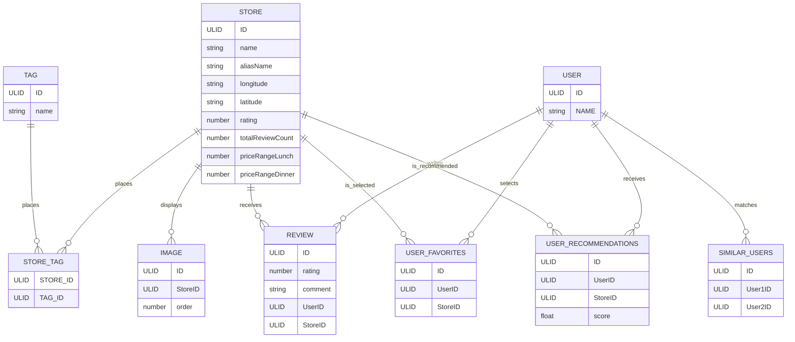

# ER図

（仮）

```mermaid
erDiagram

    STORE ||--o{ STORE_TAG : places
    STORE {
        ULID ID
        string name
        string aliasName
        string longitude
        string latitude
        number rating
        number totalReviewCount
        number priceRangeLunch
        number priceRangeDinner
    }

    STORE_TAG {
        ULID STORE_ID
        ULID TAG_ID
    }

    TAG ||--o{ STORE_TAG : places
    TAG {
        ULID ID
        string name
    }

    USER {
        ULID ID
        string NAME
    }

    USER ||--o{ REVIEW : writes
    STORE ||--o{ REVIEW : receives
    REVIEW {
        ULID ID
        number rating
        string comment
        ULID UserID
        ULID StoreID
    }

    STORE ||--o{ IMAGE : displays
    IMAGE {
        ULID ID
        ULID StoreID
        number order
    }

    USER ||--o{ USER_FAVORITES : selects
    STORE ||--o{ USER_FAVORITES : is_selected
    USER_FAVORITES {
        ULID ID
        ULID UserID
        ULID StoreID
    }

    USER ||--o{ USER_RECOMMENDATIONS : receives
    STORE ||--o{ USER_RECOMMENDATIONS : is_recommended
    USER_RECOMMENDATIONS {
        ULID ID
        ULID UserID
        ULID StoreID
        float score
    }

    USER ||--o{ SIMILAR_USERS : matches
    SIMILAR_USERS {
        ULID ID
        ULID User1ID
        ULID User2ID
    }
```
